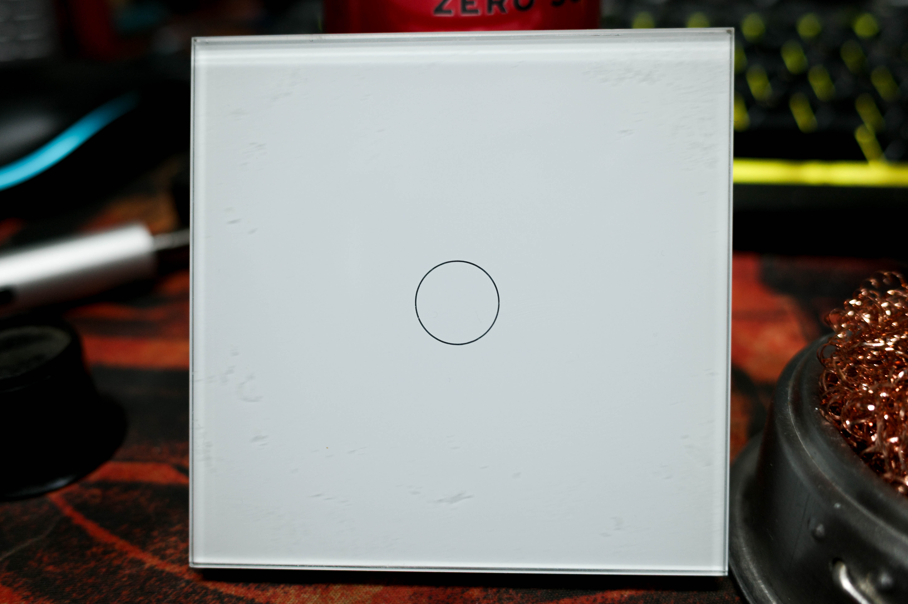
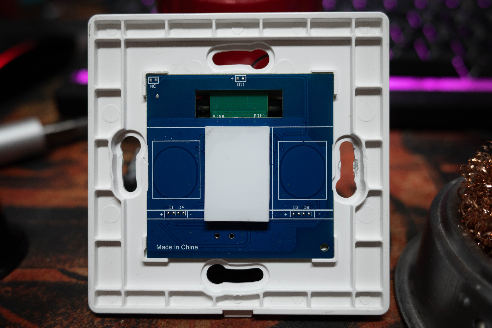
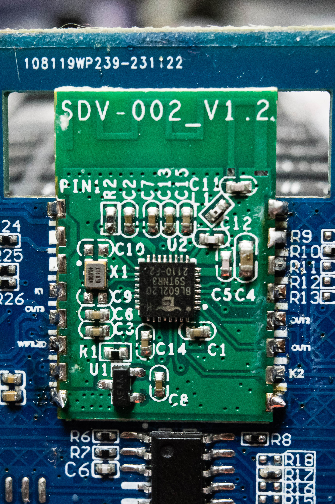
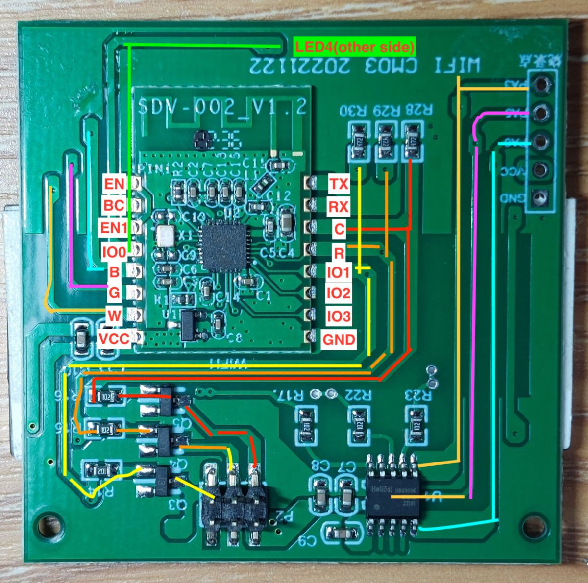
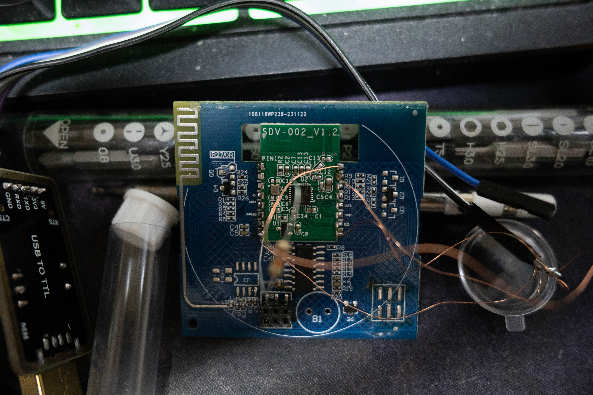
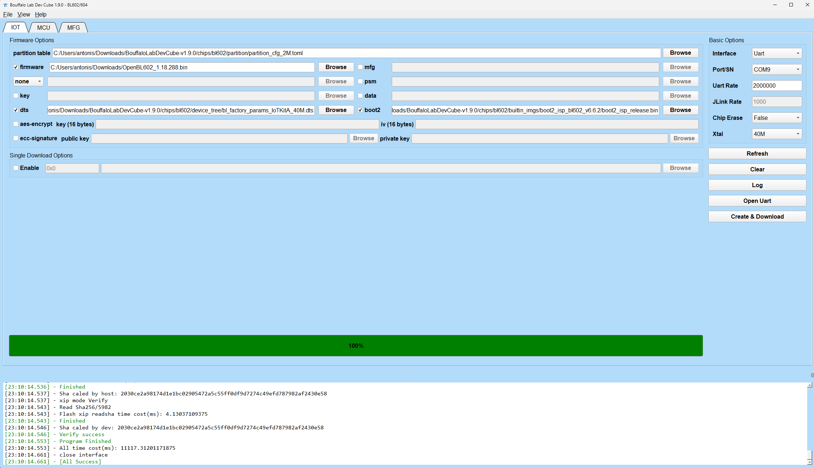
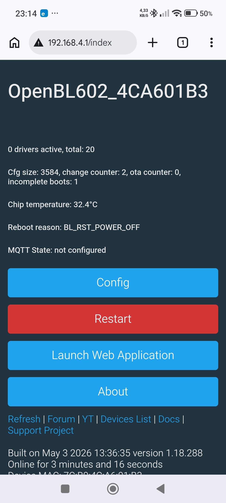

# Flashing a SmartWise T61 (BL602) with OpenBL602

This guide explains how to flash a **SmartWise T61** (eWeLink compatible, no-neutral capacitive touch wall switch) with **OpenBL602 / OpenBeken** firmware.

> ⚠️ **Warning**
>
> This device is connected to mains voltage (230V AC).
> Always disconnect it from mains power before opening it or soldering wires.
> Flash only using a **3.3V USB-to-TTL adapter**.
> **Do NOT use 5V TTL adapters.**

---

# The switch

SmartWise T61 no-neutral touch switch:



Inside view:



---

# Required tools

## USB to TTL adapter

You need a **3.3V USB-to-TTL serial adapter**.

Examples:

* CH340G
* CP2102
* FT232RL

---

## Software

### Bouffalo Lab Dev Cube

Download:

[https://dev.bouffalolab.com/download](https://dev.bouffalolab.com/download)

---

## Firmware

OpenBeken / OpenBL602 releases:

[https://github.com/openshwprojects/OpenBK7231T_App/releases](https://github.com/openshwprojects/OpenBK7231T_App/releases)

Example firmware used:

```text
OpenBL602_1.18.288.bin
```

Direct link:

[https://github.com/openshwprojects/OpenBK7231T_App/releases/download/1.18.288/OpenBL602_1.18.288.bin](https://github.com/openshwprojects/OpenBK7231T_App/releases/download/1.18.288/OpenBL602_1.18.288.bin)

---

# Opening the switch

The BL602 module is located on the rear side of the small blue daughterboard.

You must:

1. Remove the blue PCB
2. Carefully flip it over
3. Access the BL602 pins

---

## BL602 module

The blue daughterboard removed and reversed:



---

# Wiring

Pinout reference (source: elektroda.pl):



---

## Connections

| BL602 board | USB-TTL adapter |
| ----------- | --------------- |
| VCC         | 3.3V            |
| GND         | GND             |
| TX          | RX              |
| RX          | TX              |

Additionally:

| Signal | Connection                   |
| ------ | ---------------------------- |
| EN     | 3.3V through a 10kΩ resistor |

The EN pull-up forces the BL602 into bootloader mode.

---

## Example wiring



---

# Flashing procedure

## 1. Start Bouffalo Lab Dev Cube

Open the software.

---

## 2. Configure serial port

Select:

* Correct COM port
* Baud rate: `2000000` or `115200`

If flashing fails at high speed, use `115200`.

---

## 3. Select firmware

Choose:

```text
OpenBL602_1.18.288.bin
```

---

## 4. Enter bootloader mode

The BL602 must be powered while:

```text
EN -> 3.3V via 10kΩ
```

is connected.

---

## 5. Flash firmware

Click:

```text
Create & Download
```

Wait for completion.

---

  

---

## 6. Disconnect wiring

After successful flashing:

* Disconnect USB-TTL
* Remove temporary EN resistor wiring
* Reassemble the switch

---

# First boot

After booting, OpenBL602 creates a WiFi AP.

Connect to it and open:

```text
192.168.4.1
```

---

## First boot screen



---

# Initial configuration

Configure:

* WiFi SSID
* WiFi password
* MQTT settings (optional)

---

# GPIO configuration

Typical SmartWise T61 mappings may vary slightly by hardware revision.

Example:

| GPIO | Function |
| ---- | -------- |
| P0   | Relay    |
| P12  | Button   |

> ⚠️ Do not use GPIO finder with pull-up modes on capacitive touch pins.
> Using `input pull-up` may cause the touch button to become permanently triggered.

---

# Important note about the capacitive touch button

This switch uses a capacitive touch sensor.

The touch sensor is extremely sensitive to:

* panel distance
* plastic geometry
* dielectric layers
* GPIO pull-up configuration

If the switch continuously reports:

```text
Button_OnLongPressHold
```

then:

* verify GPIO configuration
* avoid pull-ups
* ensure the front panel is assembled exactly as originally designed

---

# MQTT and Home Assistant

OpenBL602 supports:

* MQTT
* Home Assistant auto discovery

Example MQTT base topic:

```text
OfficeLight
```

---

# Useful links

OpenBeken:
[https://github.com/openshwprojects/OpenBK7231T_App](https://github.com/openshwprojects/OpenBK7231T_App)

OpenBeken documentation:
[https://github.com/openshwprojects/OpenBK7231T_App/tree/main/docs](https://github.com/openshwprojects/OpenBK7231T_App/tree/main/docs)

Bouffalo Lab:
[https://dev.bouffalolab.com/](https://dev.bouffalolab.com/)

---

To be continued...
